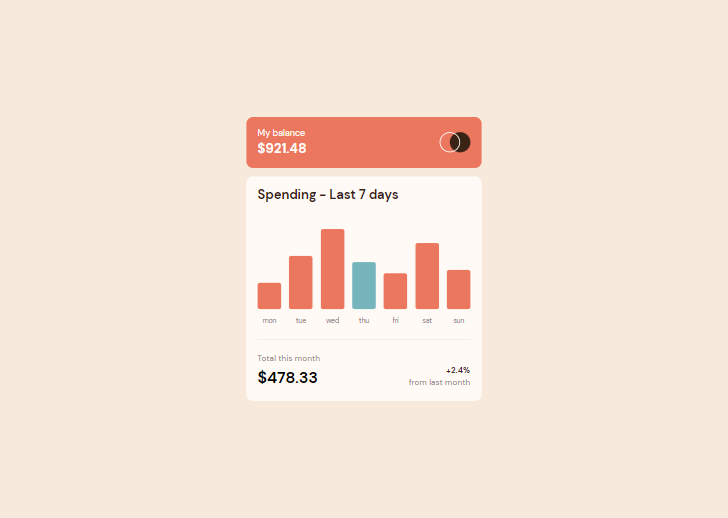
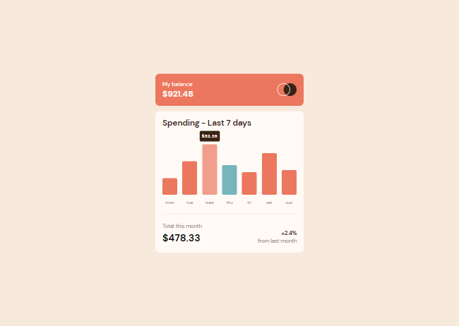
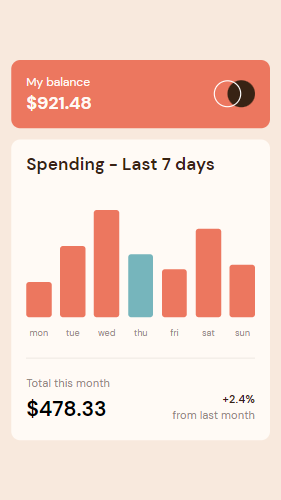

### Features

Users are able to:

- View the bar chart and hover over the individual bars to see the correct amounts for each day
- See the current day’s bar highlighted in a different colour to the other bars
- View the optimal layout for the content depending on their device’s screen size
- See hover states for all interactive elements on the page
- Uses the JSON data file provided to dynamically size the bars on the chart

### Links

- Solution URL: https://github.com/Jorge-PMarin/expenses-chart-component-FM
- Live Site URL: https://jorge-pmarin.github.io/expenses-chart-component-FM/

### Built with

- Semantic HTML5 markup
- SASS/SCSS
- Flexbox
- Mobile-first workflow

### Screenshot

